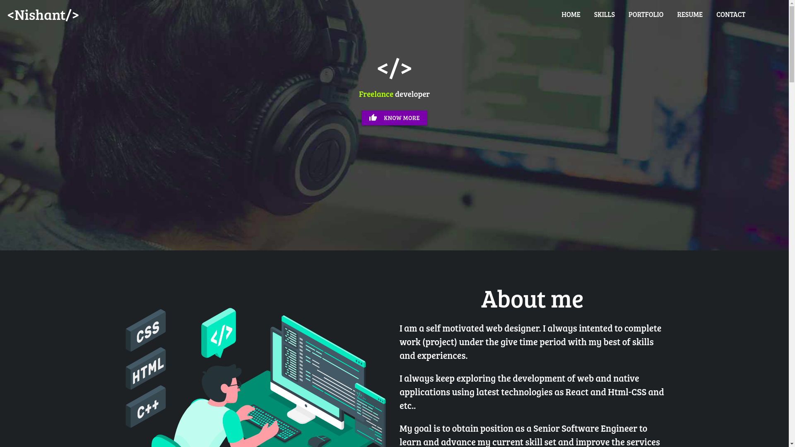
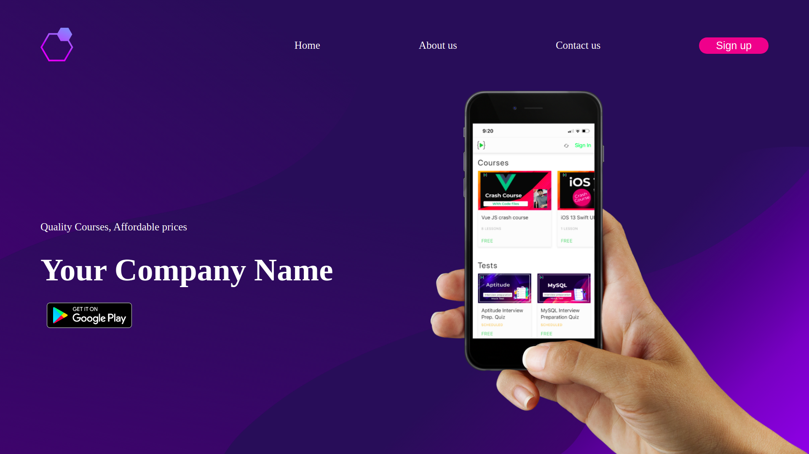
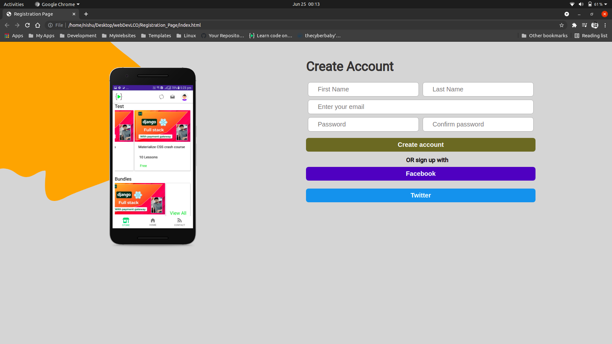
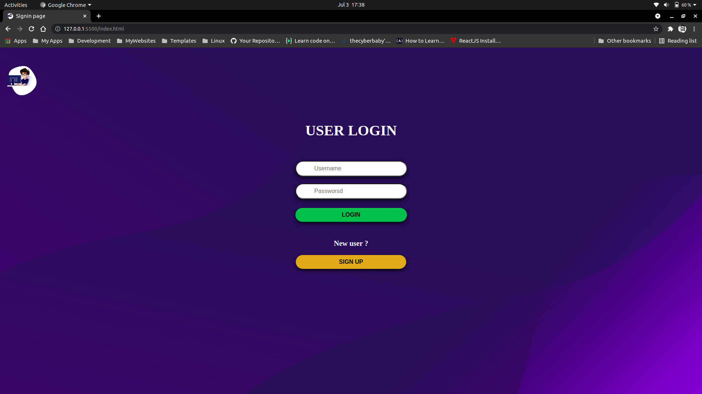

# HTML CSS

This repository contains all the HTML CSS projects
develped by ["Nishant Sharma"](https://nishantsharma.netlify.app/).

## This repository contains the following projects :

- ## Personal portfolio
  

 

- ## App landing page

 

- ## Registration page 

 

- ## User login sign up pages

  
  

   

## Usages

You can use these projects as your basic projects in HTML CSS.
